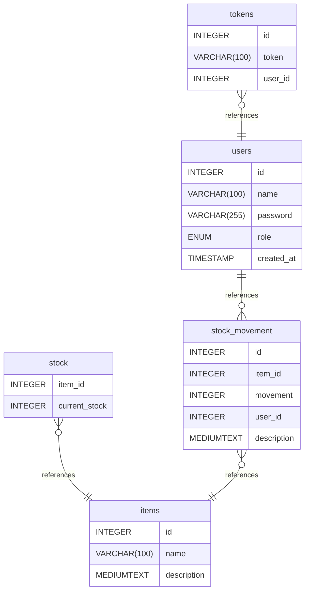

# Database Documentation

## Summary

- [Introduction](#introduction)
- [Database Type](#database-type)
- [Table Structure](#table-structure)
  - [items](#items)
  - [stock](#stock)
  - [stock_movement](#stock_movement)
  - [tokens](#tokens)
  - [users](#users)
- [Relationships](#relationships)
- [Database Diagram](#database-diagram)

## Introduction

Inventory databases used to store information about inventory stock, like stock movement, items and their numbers, also used to store users for API usage.

## Database type

- **Database system:** MariaDB

## Table structure

### items

| Name            | Type         | Settings                       | References | Note |
| --------------- | ------------ | ------------------------------ | ---------- | ---- |
| **id**          | INTEGER      | 🔑 PK, not null, autoincrement |            |      |
| **name**        | VARCHAR(100) | not null                       |            |      |
| **description** | MEDIUMTEXT   | null, default: NULL            |            |      |

### stock

| Name              | Type    | Settings                | References             | Note |
| ----------------- | ------- | ----------------------- | ---------------------- | ---- |
| **item_id**       | INTEGER | not null, autoincrement | fk_stock_item_id_items |      |
| **current_stock** | INTEGER | not null                |                        |      |

### stock_movement

| Name            | Type       | Settings                       | References                      | Note |
| --------------- | ---------- | ------------------------------ | ------------------------------- | ---- |
| **id**          | INTEGER    | 🔑 PK, not null, autoincrement |                                 |      |
| **item_id**     | INTEGER    | not null                       | fk_stock_movement_item_id_items |      |
| **movement**    | INTEGER    | not null                       |                                 |      |
| **user_id**     | INTEGER    | not null                       |                                 |      |
| **description** | MEDIUMTEXT | not null                       |                                 |      |

### tokens

| Name        | Type         | Settings                       | References              | Note |
| ----------- | ------------ | ------------------------------ | ----------------------- | ---- |
| **id**      | INTEGER      | 🔑 PK, not null, autoincrement |                         |      |
| **token**   | VARCHAR(100) | not null                       |                         |      |
| **user_id** | INTEGER      | not null                       | fk_tokens_user_id_users |      |

### users

| Name           | Type         | Settings                               | References                 | Note |
| -------------- | ------------ | -------------------------------------- | -------------------------- | ---- |
| **id**         | INTEGER      | 🔑 PK, not null, autoincrement         | fk_users_id_stock_movement |      |
| **name**       | VARCHAR(100) | not null                               |                            |      |
| **password**   | VARCHAR(255) | not null                               |                            |      |
| **role**       | ENUM         | not null                               |                            |      |
| **created_at** | TIMESTAMP    | not null, default: CURRENT_TIMESTAMP() |                            |      |

#### Enums

##### role

- admin
- staff

## Relationships

- **stock to items**: many_to_one
- **stock_movement to items**: many_to_one
- **users to stock_movement**: one_to_many
- **tokens to users**: many_to_one

## Database Diagram

